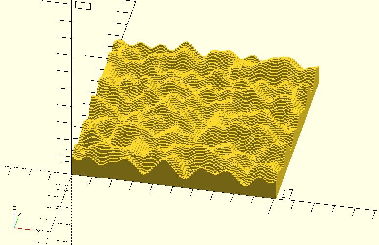

# nz_perlin2s

Returns 2D [Perlin noise](https://en.wikipedia.org/wiki/Perlin_noise) values at (x, y) coordinates.

**Since:** 2.3

## Parameters

- `points` : A list of `[x, y]` coordinates.
- `seed` : The random seed. If it's ignored, a randomized value will be used.

## Examples

    use <util/rand.scad>
    use <noise/nz_perlin2s.scad>

    seed = rand(0, 255);

    for(y = [0:.1:10]) {
        points = [for(x = [0:.1:10]) [x, y]];
        noises = nz_perlin2s(points, seed);
        for(i = [0:len(points) - 1]) {
            translate(points[i])
            linear_extrude(noises[i] + 1)
                square(.1);
        }
    }

