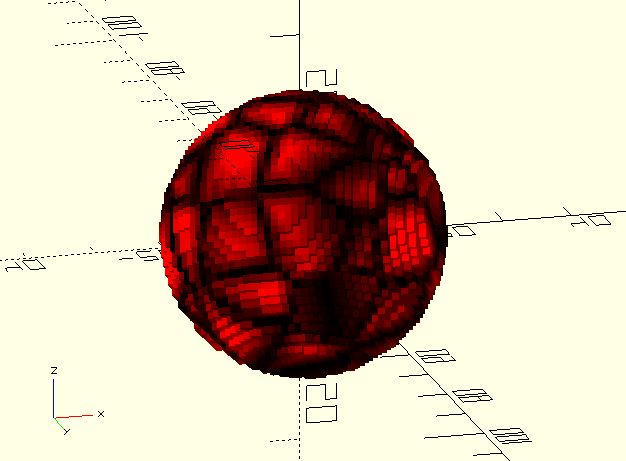

# nz_worley3

Returns the 3D [Worley noise](https://en.wikipedia.org/wiki/Worley_noise) value `[cell_x, cell_y, cell_z, noise]` at the (x, y, z) coordinate. 

It divides the space into grids. The nucleus of each cell is randomly placed in a grid. 

**Since:** 2.3

## Parameters

- `x` : The x coordinate.
- `y` : The y coordinate.
- `z` : The z coordinate.
- `seed` : The random seed.
- `grid_w` : The grid width. Default to 10. Smaller `grid_w` makes more cells.
- `dist` : The noise value of each point is based on its distance to other cells. Different distance strategies make different noises. The `dist` parameter accepts `"euclidean"`, `"manhattan"`, `"chebyshev"` or `"border"`.

## Examples

    use <voxel/vx_sphere.scad>
    use <noise/nz_worley3.scad>

    grid_w = 10;
    dist = "border"; // [euclidean, manhattan, chebyshev, border] 
    seed = 51;

    points = vx_sphere(20);

    cells = [for(p = points) nz_worley3(p.x, p.y, p.z, seed, grid_w, dist)];

    max_dist = max([for(c = cells) c[3]]);
    for(i = [0:len(cells) - 1]) {
        c = cells[i][3] / max_dist * 1.5;
        color([c > 1 ? 1 : c, 0, 0])
        translate(points[i])
            cube(1);
    }

