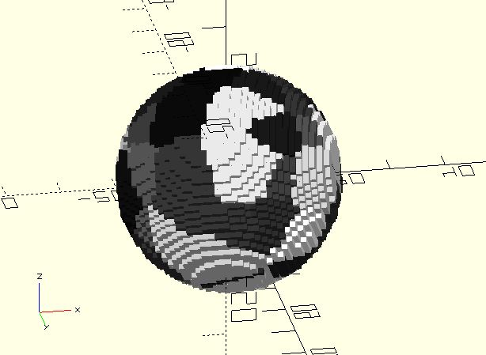
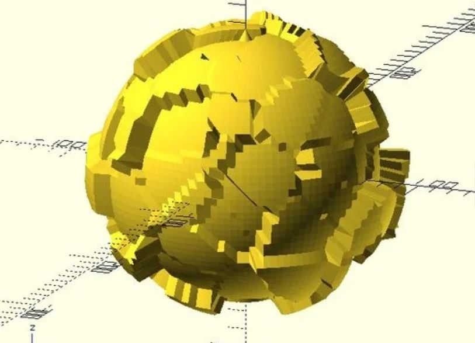

# nz_worley3s

Returns 3D [Worley noise](https://en.wikipedia.org/wiki/Worley_noise) values `[cell_x, cell_y, cell_z, noise]` at (x, y, z) coordinates. 

It divides the space into grids. The nucleus of each cell is randomly placed in a grid. 

**Since:** 2.3

## Parameters

- `points` :  A list of `[x, y, z]` coordinates.
- `seed` : The random seed.
- `grid_w` : The grid width. Default to 10. Smaller `grid_w` makes more cells.
- `dist` : The noise value of each point is based on its distance to other cells. Different distance strategies make different noises. The `dist` parameter accepts `"euclidean"`, `"manhattan"`, `"chebyshev"` or `"border"`.

## Examples

    use <voxel/vx_sphere.scad>
    use <noise/nz_worley3s.scad>

    grid_w = 10;
    dist = "euclidean"; // [euclidean, manhattan, chebyshev, border] 
    seed = 51;

    points = vx_sphere(20);
    cells = nz_worley3s(points, seed, grid_w, dist);

    for(i = [0:len(cells) - 1]) {
        c = (norm([cells[i].x, cells[i].y, cells[i].z]) % 20) / 20;
        color([c, c, c])
        translate(points[i])
            cube(1);
    }

You can build things like [worley_noise_ball](https://github.com/JustinSDK/dotSCAD/blob/master/examples/worley_noise_ball.scad). 

