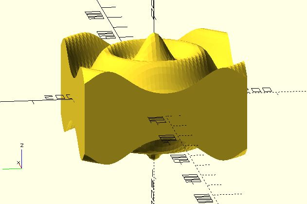

# sf_solidify

It solidifies two square surfaces, described by a m * n list of `[x, y, z]`s. 

**Since:** 2.3

## Parameters

- `surface1` : A m * n list of `[x, y, z]`s.
- `surface2` : A m * n list of `[x, y, z]`s.
- `slicing` : Given a rectangle, we have two ways to slice it into two triangles. Using this parameter to determine the way you want. It accepts `"SLASH"` (default) and `"BACK_SLASH"`.
- `convexity` : Integer. This parameter is needed only for correct display of the object in OpenCSG preview mode. It has no effect on the polyhedron rendering. For display problems, setting it to 10 should work fine for most cases. **Since:** 3.3

## Examples

    use <surface/sf_solidify.scad>

    function f(x, y) = 
    30 * (
        cos(sqrt(pow(x, 2) + pow(y, 2))) + 
        cos(3 * sqrt(pow(x, 2) + pow(y, 2)))
    );

    thickness = 2;
    min_value =  -200;
    max_value = 200;
    resolution = 10;

    surface1 = [
        for(y = [min_value:resolution:max_value])
        [
            for(x = [min_value:resolution:max_value]) 
                [x, y, f(x, y) + 100]
        ]
    ];

    surface2 = [
        for(y = [min_value:resolution:max_value])
        [
            for(x = [min_value:resolution:max_value]) 
                [x, y, -f(x, y) - 100]
        ]
    ];

    sf_solidify(surface1, surface2);

