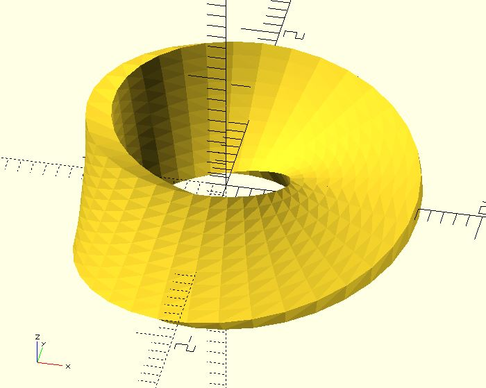

# sf_thickenT

It thickens a surface with triangular mesh. 

## Parameters

- `points` : A list of `[x, y, z]`s.
- `thickness` : The depth of the thickening.
- `triangles` : Determine which points are connected by an edge. All triangles have points in the same direction, counter-clockwise. If it's ignored, `sf_thickenT` would use `[x, y]` to do Delaunay trianglation.  
- `direction` : The direction of thickening. It accepts `"BOTH"` (default), `"FORWARD"` or `"BACKWARD"`. Thickening is applied in both directions from the surface, the direction of the surface normals or the opposite direction to the surface normals. It also accept a direction vector `[x, y, z]`. Thickening is only applied in the direction you give.
- `convexity` : Integer. This parameter is needed only for correct display of the object in OpenCSG preview mode. It has no effect on the polyhedron rendering. For display problems, setting it to 10 should work fine for most cases. **Since:** 3.3

## Examples

	use <surface/sf_thickenT.scad>

	thickness = .2;

	a_step = 15;
	r_step = 0.2;

	function f(x, y) = (y ^ 2 - x ^ 2) / 4;

	points = [
		for(a = [a_step:a_step:360], r = [r_step:r_step:2])
		let(
			x = r * cos(a), 
			y = r * sin(a)
		)
		[x, y, f(x, y)] 
	];

	sf_thickenT(points, thickness);

	use <triangle/tri_delaunay.scad>
	use <surface/sf_thickenT.scad>

	u_step = 10;
	v_step = 0.2;
	thickness = .2;

	points = [
		for(u = [0:u_step:360], v = [-1:v_step:1])
		let(
			x = (1 + v / 2 * cos(u / 2)) * cos(u),
			y = (1 + v / 2 * cos(u / 2)) * sin(u),
			z = v / 2 * sin(u / 2)
		)
		[x, y, z]
	];

	triangles = tri_delaunay([
		for(u = [0:u_step:360])
			for(v = [-1:v_step:1])
			[v, u]
	]);

	sf_thickenT(points, thickness, triangles);

