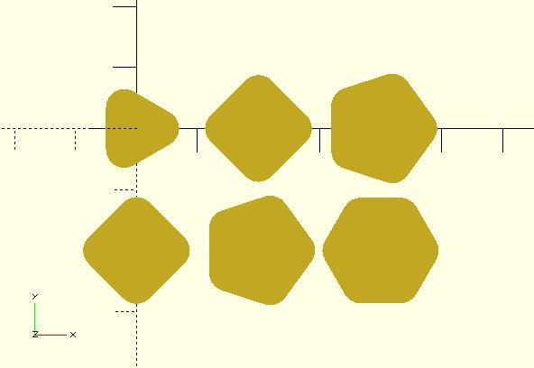
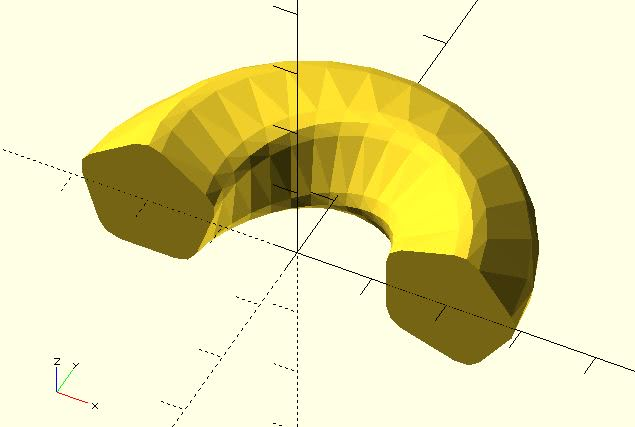

# shape_cyclicpolygon

Returns shape points of a regular cyclic polygon. They can be used with xxx_extrude modules of dotSCAD. The shape points can be also used with the built-in polygon module. 

## Parameters

- `sides` : The sides of the circle.
- `circle_r` : The radius of the circumcircle.
- `corner_r` : The radius of the circle at a corner.
- `$fa`, `$fs`, `$fn` : Check [the circle module](https://en.wikibooks.org/wiki/OpenSCAD_User_Manual/Using_the_2D_Subsystem#circle) for more details.

## Examples

    use <shape_cyclicpolygon.scad>

    circle_r = 10;
    corner_r = 3;

    $fn = 24;

    for(i = [0:2]) {
        translate([i * circle_r * 2, 0, 0]) 
            polygon(
                shape_cyclicpolygon(
                    sides = 3 + i, 
                    circle_r = circle_r, 
                    corner_r = corner_r
                )
            );
    }

    for(i = [0:2]) {
        translate([i * circle_r * 2, -circle_r * 2, 0]) 
            polygon(
                shape_cyclicpolygon(
                    sides = 4 + i, 
                    circle_r = circle_r , 
                    corner_r = corner_r
                )
            );
    }

    use <shape_cyclicpolygon.scad>
    use <ring_extrude.scad>

    shape_pts = shape_cyclicpolygon(
        sides = 5, 
        circle_r = 10, 
        corner_r = 3
    );

    ring_extrude(shape_pts, radius = 20, angle = 180, twist = 90);

