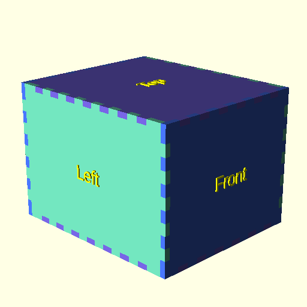
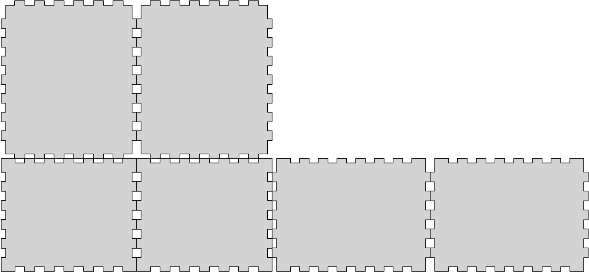
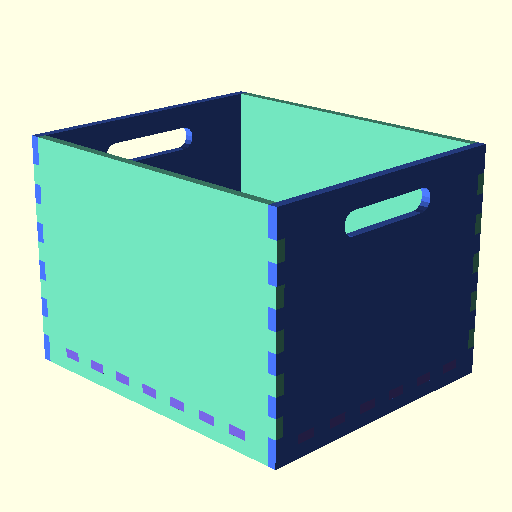
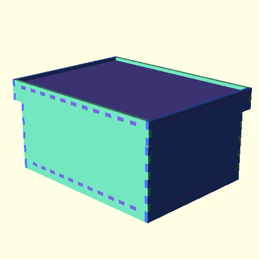
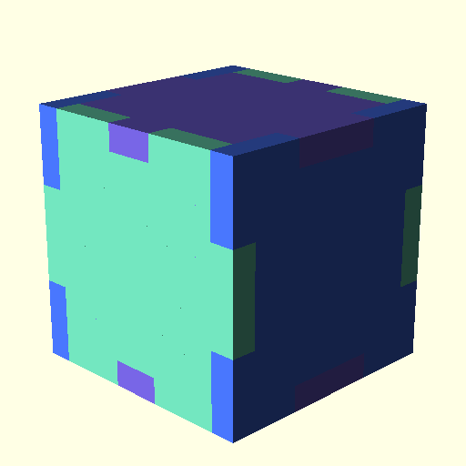

[comment]: vim:tw=80
# Laser cut Box OpenSCAD Module

This is an OpenSCAD module for creating boxes to be laser-cut out of
flat panels (e.g. plywood or acrylic). The boxes dimensions are
customizable, supports opening the top, insetting the bottom, and
adding handles.

Forked from [lasercut-box-openscad](https://github.com/larsch/lasercut-box-openscad/) by
[Roy Sigurd Karlsbakk](mailto:roy@karlsbakk.net). Please see License paragraph at the bottom.

## synopsis

```
box(options);
```

## options

 * width (length) - outer width of box
 * height (length) - outer height of box
 * depth (length) - outer depth of box
 * inner (boolean) - width/height/depth are inner dimensions
 * thickness (length) - material thickness
 * finger_width (length) - target finger width
 * finger_margin (length) - distance from inside edge to first finger
 * open (boolean) - removes the top
 * inset (length) - amount to inset the bottom side
 * assemble (boolean) - render assembled 3d box instead of 2d cutting plans
 * hole_width - width of handle hole
 * hole_height - height of handle hole
 * hole_margin - distance from top edge to handle hole
 * kerf (diameter) - cutting kerf (rendering will be offset by half this)
 * dividers (array with two elements) - how many dividers to insert in x and y directions
 * holes (array) - where to place rivet holes
 * hole_dia (length) - diameter of rivet holes
 * ears (boolean) - if true, 'ears' for hinges are generated
 * robust_ears (boolean) - if true, 'ears' are double the length (2x thickness
     instead of 1x), making them slightly tougher and also, making the top lid
     1x thickness longer in the back.
 * double_doors (boolean) - create double doors, for use with 'ears'
 * door_knob (diameter) - create hole for door knob (but not the knob itself)
 * spacing (length) - add more spacing between the objects.

All values are given in millimetres unless specified otherwise.

## examples

```scad
include <box.scad>
box(width = 120, height = 100, depth = 140, thickness = 4, assemble = true);
```



Dimensions are outer by default. Set ```inner = true``` to render a box based on inner dimensions:

```scad
include <box.scad>
box(width = 120, height = 100, depth = 140, thickness = 4, inner = true, assemble = true);
```

Set ```assemble = false``` to render the final rendering for cutting:



Another example with open top and handles:



You can use another box as a lid:



The target finger size can be adjusted using the ```finger_width``` option, but it will be adjusted depending on the box dimensions:



## Todo

 * robust_ears isn't supported (ignored) with double_doors
 * boxmag.scad added, borrowed by jmankoff from [issue 6](https://github.com/larsch/lasercut-box-openscad/issues/6), but not merged into box.scad because of issues.
 * 3d rendering of box with robust ears and double doors looks wrong, but the 2d model is ok

## License

Copyright (c) 2016 Lars Christensen

Permission is hereby granted, free of charge, to any person obtaining
a copy of this software and associated documentation files (the
"Software"), to deal in the Software without restriction, including
without limitation the rights to use, copy, modify, merge, publish,
distribute, sublicense, and/or sell copies of the Software, and to
permit persons to whom the Software is furnished to do so, subject to
the following conditions:

The above copyright notice and this permission notice shall be
included in all copies or substantial portions of the Software.

THE SOFTWARE IS PROVIDED "AS IS", WITHOUT WARRANTY OF ANY KIND,
EXPRESS OR IMPLIED, INCLUDING BUT NOT LIMITED TO THE WARRANTIES OF
MERCHANTABILITY, FITNESS FOR A PARTICULAR PURPOSE AND
NONINFRINGEMENT. IN NO EVENT SHALL THE AUTHORS OR COPYRIGHT HOLDERS BE
LIABLE FOR ANY CLAIM, DAMAGES OR OTHER LIABILITY, WHETHER IN AN ACTION
OF CONTRACT, TORT OR OTHERWISE, ARISING FROM, OUT OF OR IN CONNECTION
WITH THE SOFTWARE OR THE USE OR OTHER DEALINGS IN THE SOFTWARE.

